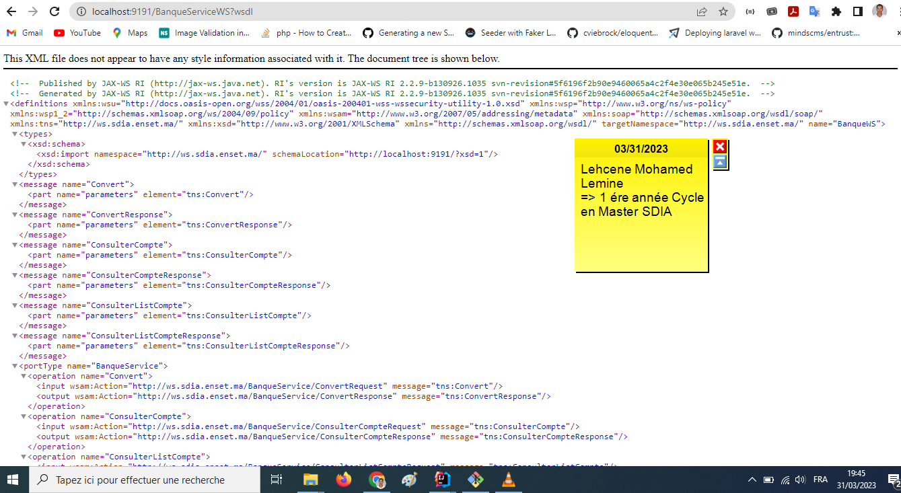
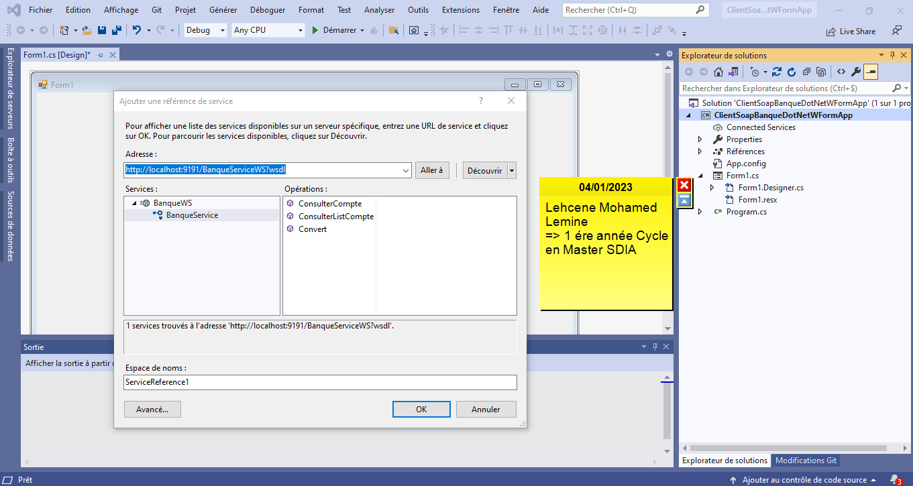
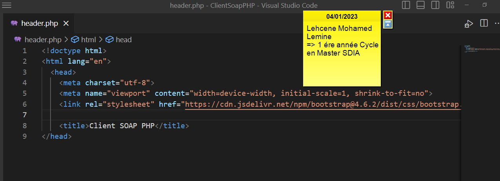

<h3>Compte rendu En Web Service réaliser par => Lehcene Mohamed Lemine Master SDIA ENSET-Mohammedia
</h3>

1.Question - Créer un Web service qui permet de : 

<ul>
<li>Convertir un montant de l’auro en DH.</li>
<li>Consulter un Compte.</li>
<li>Consulter une Liste de comptes.</li>
</ul>

2.Question - Déployer le Web service avec un simple Serveur JaxWS

3.Question - Consulter et analyser le WSDL avec un Browser HTTP

Voici Notre web Service qu'on a consulter par un browser HTTP CHROME qui est juste un document XML qui permet de fait la description de l'interface de WEB SERVICE et contient également les noms de methodes qui propose notre WEB SERVICE.

4.Question - Tester les opérations du web service avec un outil
comme SoapUI ou Oxygen

On Tester notre web service avec SOAPUI.

On doit donner le nom pour projet qu'on a construire dans l'outil SOAPUI et L'address WSDL pour le webservice qu'ont doit le tester.

Donc il afficher les différents méthodes qui propose notre web service.

Voici le résultat aprés teste pour le méthode Convert qui consiste seulement a converture en montant de l'auro en DH.

Voici la résultat aprés teste pour le méthode ConsulterCompte qui permet de nous de consulter une compte par son code.

Voici le résultat aprés teste pour le méthodes ConsultListCompte qui consiste a afficher liste de comptes.

5. Créer un Client SOAP Java

Voici Capture ecran pour code source pour client SOAP en Java avec JaxWS.

Voici Capture ecran pour Tester Les différents methodes qui propose notre WebService avec Client JOAP Java. 

6. Créer un Client SOAP Dot Net

Dans cette partie je créer un application windows form qui permet de Consulter notre WEB SERVICE.

D'abord On doit donner L'address WSDL pour le webservice qu'ont doit le consulter par Client SOAP DOTNET.

Donc lorsqu'on cliquer sur bouton (Aller à) il m'afficher les différents méthodes qui propose mon web service.

Voici un capture ecran pour client SOAP DOTNET qui 
a une interface graphique créer avec Windows Froms Application qui contient 
textBox pour saisir un Montant , textBox pour afficher resultat de conversion en DH, 
DataGridView pour afficher resultat lorsque on clique sur button Comptes et 
des boutons pour consulter les différentes méthodes (Convert en DH et Afficher Liste des Comptes).

Voici le résultat aprés teste pour le méthode Convert lorsque on sasir 
un montant dans textBox et on click sur button 
Conversion qui consiste seulement a converture en montant de l'auro en DH.

Voici le résultat aprés teste pour le méthode ConsultListCompte avec Client SOAP DOTNET
lorsque on click sur button (Comptes) qui permet d'Afficher Liste des Comptes dans une DataGridView.

Voici capture ecran code source pour client soap avec DotNet et 
on utilise des événements pour effectuer les opérations.

7. Créer un Client SOAP PHP

Voici capture ecran code source pour client soap avec PHP.

Layout Header.

Layout Footer.

Voici un capture ecran pour client SOAP PHP qui a une interface créer avec framework Bootstrap
qui contient 3 boutons pour tester avec notre client SOAP PHP Les différents méthodes qui propose notre Web Service.

Voici le résultat aprés teste  pour le méthode Convert lorsque on sasir un montant dans input et on click sur button Convert qui consiste seulement a converture en montant de l'auro en DH. 

Voici le résultat aprés teste  pour le méthode ConsulterCompte lorsque on sasir un code du compte dans input et on click sur button Consulter un Compte qui permet de nous de consulter une compte par son code et on afficher le résultat dans un tableau.

Voici le résultat aprés teste  pour le méthode ConsultListCompte lorsque on click sur button Afficher Liste des Comptes qui consiste a afficher liste de comptes et on affiche le résultat dans une tableau.

